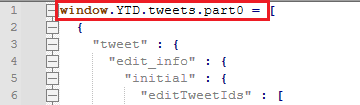
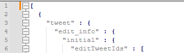

[English](README.md) | [Russian](README_ru.md)

## Описание

Вы можете использовать этот скрипт, чтобы удалить твиты в своём профиле X (бывший Twitter).
Так как API X с 2026 года нельзя использовать бесплатно, этот скрипт использует автоматизацию через Selenium. 
Удаление твитов займёт некоторое время, но это абсолютно бесплатно, вам не нужно будет передавать свои логин и пароль, всё делается исключительно на вашем ПК.

Вы залогиниваетесь в свой профиль X, далее скрипт на вашем ПК автоматически открывает браузер, переходит по ссылкам на твиты и удаляет их.

Скрипт работает на Windows 10, 11, только с браузером Google Chrome Portable.

## Дисклеймер

Используйте скрипт на свой страх и риск. Я не несу ответственности за ваш аккаунт. Если сомневаетесь, лучше не используйте вообще.

Скрипт не гарантирует 100% удаления твитов, но твиты, полученные в выгрузке от X должны удалиться. Ссылки на твиты, которые скрипт не сможет найти, будут дополнительно размещены в файле `not_found_tweets.txt`.

Я не рекомендую изменять в коде такие параметры как:

* Количество удаляемых твитов
* Временные задержки между действиями скрипта

Текущие параметры протестированы лично мной. С этими параметрами я успешно удалила около 5800 твитов. Изменение этих параметров может привести к непредсказуемым последствиям для вашего аккаунта.

## Возможности

Я постаралась сделать так, чтобы скрипт имитировал действия человека:

* Скрипт удаляет твиты партиями по 20-25 твитов за раз
* Делает рандомные паузы между нажатиями кнопок и удалением твитов
* Делает рандомное открытие страниц соц.сети и небольшой скрол на них между удалением твитов
* Хранит статистику в БД SQLite
* Можно задать временной диапазон твитов

## Установка

1. Запросите в X архив ваших твитов. Для этого зайдите в X, выберите "Еще" -> "Настройки и конфиденциальность" -> "Ваша учетная запись" -> "Скачайте архив своих данных".
Архив готовится около 2-х дней.
2. Скачайте архив, разархивируйте. В папке `data` найдите файл `tweets.js`. 
Откройте его через текстовый редактор и удалите в начале строку `window.YTD.tweets.part0 = ` 
до квадратной скобки и сохраните файл в формате **JSON**. Например: `tweets.json`.



3. Скачайте/склонируйте репозиторий.
4. Установите [Python](https://www.python.org/downloads/ "Python") 3.12 или выше. При установке поставьте галочку `Add python.exe to PATH`.
5. Установите браузер [Google Chrome Portable](https://portableapps.com/apps/internet/google_chrome_portable "Google Chrome Portable"). **С классическим Chrome скрипт не работает!**
6. Откройте браузер Google Chrome Portable, залогиньтесь в X (<https://x.com/>), примите все куки. 
**Обязательно переключите в настройках X язык на английский**: "Еще" -> "Настройки и конфиденциальность" -> "Специальные возможности, оформление и языки", закройте браузер.
7. Установите uv
```
winget install astral-sh.uv
```
8. Перейдите в каталог со скриптом
```
cd <путь к каталогу>
```
9. Установите зависимости
```
uv sync
```
10. Переименуйте файл `configuration.ini.example` в `configuration.ini` и заполните следующие поля:

* **json_path** - путь к json-файлу на шаге 2
* **chrome_exe_path** - путь к chrome.exe, пример пути: `D:\PortableApps\GoogleChromePortableNew\App\Chrome-bin\chrome.exe`
* **chrome_user_profile_path** - путь к профилю Chrome Portable, пример пути: `D:\PortableApps\GoogleChromePortableNew\Data\profile`
* **version** - оставьте по умолчанию значение `None` для автоматического определения версии браузера. 
В случае, если у вас будут ошибки связанные с версией браузера, укажите в этом поле первую цифру версии Chrome. 
Например, если версия Chrome `151.0.7922.72`, укажите `151`

Оставьте оба следующих поля в значении `None` если вы хотите удалить все твиты, или укажите в двух полях 
даты начала и конца временного периода в формате ISO (`YYYY-MM-DD`). Например: `2026-01-01` и `2026-12-31`

* **start_date** - дата начала временного периода
* **end_date** - дата окончания временного периода

11. Запустите в работу скрипт
```
uv run main.py
```

## Режимы работы

### 1. Delete one batch of tweets

Скрипт удаляет 1 партию твитов и завершает работу. Удаление 1 партии занимает примерно 5-10 минут.

### 2. Delete multiple batches of tweets

В этом режиме вы можете задать количество партий, которые удалит скрипт. 
После удаления партии твитов, браузер закроется, будет указано время, когда начнется удаление следующей партии. 
Не завершайте работу самого скрипта. 
Между первыми тремя партиями скрипт будет делать рандомную паузу в 20-40 минут, после 3-й партии сделает долгую паузу в 120-240 минут. 
Затем алгоритм повторится.

## Особенности работы и рекомендации по использованию

* Скрипт работает только с теми твитами, которые X предоставит в выгрузке архива.
* Если хотите от кого-то отписаться, лучше сделайте это после того, как удалите все необходимые твиты.
* Запускайте скрипт только с закрытым браузером, скрипт будет открывать браузер самостоятельно.
* Пока идёт процесс удаления партии твитов, не используйте параллельно ПК, браузер и не входите в X с других устройств.
* При старте скрипта браузер может открыться не моментально, это нормально, просто подождите.
* Не злоупотребляйте количеством. Если удаляете по 1 партии, то делайте паузы между удалениями в 20-40 минут. 
После удаления нескольких партий сделайте большой перерыв на несколько часов.
* Не старайтесь удалить всё за 1 день. Удаляйте по 100-200 твитов за день с перерывами. 
Не запускайте скрипт работать круглосуточно.
* Если вы видите, что скрипт перестал загружать страницы или он завершил работу с предупреждением 
о возможной капче, завершите скрипт, откройте браузер вручную, перейдите в X и попробуйте удалить 
любой твит вручную. После этого сделайте перерыв.
* Если вы удалили твиты за определенный временной промежуток и хотите удалить за другой, 
удалите или переместите из каталога скрипта файл `tweets.db`, измените даты в файле `configuration.ini` 
и запустите скрипт повторно.

